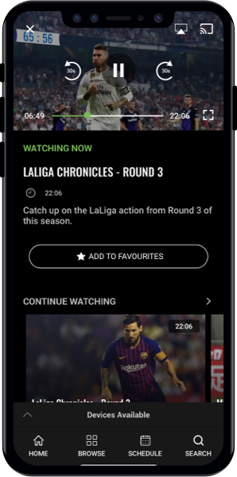

<p align="center">
  
</p>

# Dice Connect &middot; [](https://github.com/DiceTechnology/dice-connect/pulls)

# DEPRECATED

Welcome to **Dice Connect**! A library to uniformly allow react native modules to be connected to Chromecast, Airplay and other devices.


- [Getting Started](#getting-started)
- [Projects](#projects)
    - [Automatic installation](#automatic-installation)
    - [Manual installation](#manual-installation)
- [Usage](#usage)
    - [Airplay](#airplay)
    - [Chromecast](#chromecast)
- [Features To Be Added](#features-to-be-added)
<p align="center">
  
</p>


## Getting Started

`$ npm install dice-connect --save`

### Automatic installation

`$ react-native link dice-connect`

### Manual installation

#### iOS

1. In XCode, in the project navigator, right click `Libraries` ➜ `Add Files to [your project's name]`
2. Go to `node_modules` ➜ `dice-connect` and add `RNDiceConnect.xcodeproj`
3. In XCode, in the project navigator, select your project. Add `libRNDiceConnect.a` to your project's `Build Phases` ➜ `Link Binary With Libraries`
4. Run your project (`Cmd+R`)<

#### Android

1. Open up `android/app/src/main/java/[...]/MainActivity.java`
  - Add `import com.dicetechnology.dcchromecast.DCGoogleCastPackage;` to the imports at the top of the file
  - Add `new DCGoogleCastPackage()` to the list returned by the `getPackages()` method
2. Append the following lines to `android/settings.gradle`:
  	```
  	include ':dice-connect'
  	project(':dice-connect').projectDir = new File(rootProject.projectDir, 	'../node_modules/dice-connect/android')
  	```
3. Insert the following lines inside the dependencies block in `android/app/build.gradle`:
  	```
      compile project(':dice-connect')
  	```
4. Add the string resource containing the id of your cast receiver to resources
      ```
      <string name="cast_id" translatable="false">YOUR_CAST_RECEIVER_ID</string>
      ```

## Usage

### Airplay

#### Button

Note: The AirPlay button will not show whilst using the simulator. 

```javascript
import { AirPlayButton } from 'dice-connect'

<AirPlayButton style={{ height: 30, wifdth: 30 }} />
```

#### Methods 

```javascript
 AirPlay.startScan();

 AirPlay.disconnect();
```

#### Listeners

```javascript
import { AirPlayEmitter, AirPlayEvents } from 'dice-connect'

this.deviceAvailableListener = AirPlayEmitter.addListener(AirPlayEvents.DEVICE_AVAILABLE, devices => this.setState({
      airPlayAvailable: devices.airplay,
})); --> returns a boolean

this.deviceConnectedListener = AirPlayEmitter.addListener(AirPlayEvents.DEVICE_CONNECTED, devices => this.setState({
      airPlayConnected: devices.airplay,
})); --> returns a boolean


// Remove Listeners in componentWillUnmount
this.deviceAvailableListener.remove();
this.deviceConnectedListener.remove()
```

### Chromecast

#### Cast Button

See [Google Cast Button Documentation](https://developers.google.com/cast/docs/design_checklist/cast-button#sender-cast-icon-available) for more information

This component is the native google cast button and therefore will only appear when their are chromecast 
##### Props

| Name |  Type |
| --- | --- |
| **style** | ViewStyle |

#### Example

```javascript
import { CastButton } from 'dice-connect'

<CastButton style={{ height: 60, width: 60 }} />
```
#### ProgressBar

##### Example

```javascript
import { ProgressBar } from 'dice-connect'

<ProgressBar
  progressTimeHidden={false}
  progressThumbHidden={false}
  progressColorHex={'#000000'}
  style={{ height: 44, width: '100%' }}
/>
```

##### Props

| Name |  Type |
| --- | --- |
| **progressColorHex** | string |
| **progressMax** | number |
| **progressCurrent** | number |
| **progressTimeHidden** | boolean |
| **progressThumbHidden** | boolean |
| **style** | ViewStyle |


#### Methods 

| Name |  Arguments | ReturnType
| --- | --- | --- |
| **stop** | - | - |
| **start** |`(url: string, streamType: StreamType, contentType: contentType, metadata?: MetaData)` | - |
| **seek** | `(toMilliseconds: number, relative: boolean)` | - |
| **play** | - | - | 
| **pause** | - | - |
| **disconnect** | - |
| **getState** | - | DeviceScannerState


## Features to be Added
- [ ] iOS Support on ChromeCast
- [ ] Android Examples on ChromeCast
- [ ] Add Support for connectiing to Tizen TVs
- [ ] Add Support for connecting to WebOS Tvs